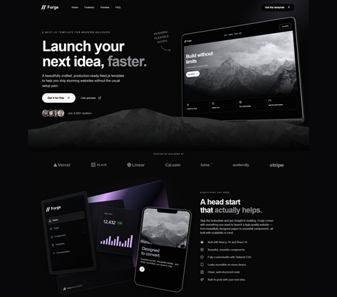

# Forge — Next.js 16 Dark-Mode Landing Page Starter

[](https://vercel.com/new/clone?repository-url=https://github.com/leverh/forge-nextjs-template)




Hey everyone — I made **Forge**, a free dark-mode landing page template for your next project. 

It’s built with Next.js 16, React 19, TypeScript, and Tailwind CSS 4, complete with responsive layouts, CSS 3D device mockups, and subtle ambient lighting. A clean starting point for a SaaS product, side project, or personal brand.

👉 **[View Live Demo](https://forge.madebyever.com/)** | 📦 **[Download ZIP / Source](https://forge.madebyever.com/)** | 🌐 **[Made By Ever](https://madebyever.com/)**

> **Looking for pre-built Auth, Stripe checkout, dashboards, or CMS integration?**  
> Check out the full commercial template suite at **[madebyever.com/templates](https://madebyever.com/templates)**.

---

I’m sharing it because, why not? If you like the style, you can find more of my projects and premium templates at [madebyever.com](https://madebyever.com/). I’m also available for freelance work if you’d like something built specifically for you or for collaborations.

If you build something with Forge, I’d love to see it. Feedback is welcome too! ❤️

## Features

- **Next.js 16 App Router & React 19:** Built on modern Server Components.
- **Pure CSS 3D Hardware Mockups:** Fluid, responsive laptop and mobile frames rendered directly in HTML/CSS.
- **Tailwind CSS v4 + Ambient FX:** Clean utility styling enhanced with subtle radial glows.
- **Zero Heavy Dependencies:** Fully type-safe TypeScript codebase with zero unnecessary third-party UI libraries.

## Quickstart

Requires Node.js 20.9+.

```sh
npm install
npm run dev
```
Open http://localhost:3000. Validate with npm run typecheck and npm run build; serve a production build with npm start.

## Project Structure & Customization
- ```app/page.tsx```: Main page content and layout sections
- ```app/globals.css```: Breakpoints, ambient lighting filters, and custom CSS hardware styles
- ```components/devices.tsx```: Pure HTML/CSS laptop, navigation, chart, and phone mockups
- ```components/actions.tsx```: Responsive navigation and accessible native template dialog
- ```public/images```: Locally hosted photography assets


**Photography credits:** Unsplash mountain and landscape images; sample portraits from randomuser.me.

## A Note on the Tech Stack

I typically prefer CSS Modules for total control over styling, but I chose Tailwind CSS here to stick with the tools the community loves. That said, I couldn't resist dropping in a few custom styles for good measure—as you'll see in globals.css! 🏳️‍🌈


## License

MIT — Free to use for personal and commercial projects.